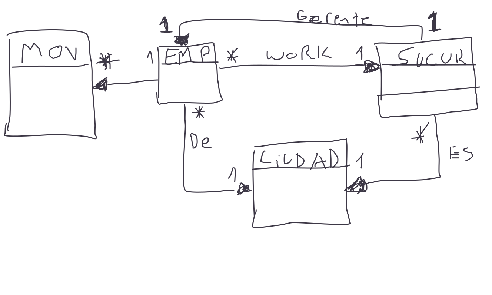
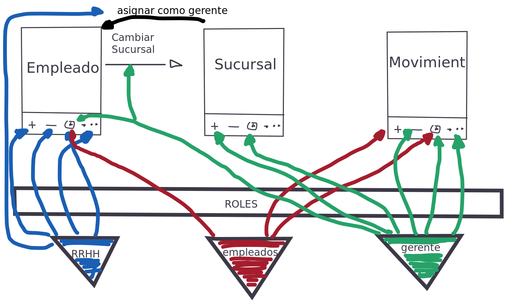

## Proyecto para entender el funcionamiento de framework activeweb con javalite.

### 1. Definicion de una base de datos de donde vamos a trabajar.

Para este ejercicio nuestro modelo de trabajo va a girar en el entorno de:

#### empleados de los cuales conocemos los siguientes datos:

* id (del sistema cual es correlativo incrementalmente)
* nombre
* apellido
* correo
* documento
* id_ciudad (en que ciudad vive)
* id_sucursal (a que sucursal pertenece)
* fecha_nacimiento
* fecha_baja
* sueldo

#### tenemos ciudades de chubut de las cuales sabemos:

* id (del sistema correlatio e incremental)
* nombre de la ciudad

#### tenemos sucursales de las cuales conocemos:

* id (del sistema correlatio e incremental)
* id_ciudad (en cual ciudad se encuentra la sucursal)
* id_empleado_gerente (que empleado es gerente de la sucursal)

#### tenemos los movimientos de los empleados los cuales registramos:
* id (del sistema correlatio e incremental)
* id_empleado (al que pertenece el movimiento)
* id_sucursal (en cual sucursal hizo el movimiento)
* fecha_hora_movimiento (hora en la cual ingreso o se retiro de este).

---

### 2. Modelo de trabajo
Existen multiples empleados para cada sucursal de nuestra organizacion, cada sucursal recide en alguna ciudad, y cada empleado reside en alguna ciudad igualmente.   
Cada sucursal tiene un empleado que es gerente de esta no hay restricciones si un empleado puede ser gerente de multiples sucursales.  
Por ultimo los empleados realizan movimientos dentro de las sucursales usualemente 2 el ingreso y egreso de esta, y puede tener multiples movimiento a lo largo de los años.

#### Diagrama DER resultante (es un bosquejo)


---

### 3. Creacion de base de datos y datos de prueba.
Por comodidad me gusta empezar por la creacion de la base de datos.  
Vamos a utilizar postgres, y el cliente que mas prefieras **(recomendacion psql)**.

Ingresamso a nuestro cliente de postgres mediante la consola de linux y ponemos la contraseña necesaria.  
`psql -W -U postgres`

Dentro de el cliente creamos la base de datos (Puedes usar el nombre que quieras).  
`create database activeweb_orm;`

Conectamos con la base de datos creada.  
`\c activeweb_orm`

Para la creacion de la estructura de las tablas y las restricciones ya esta todo hecho en el archivo **./archivos-sql/creacion_db.sql** asi que vamos a utilizarlo para ello usaremos.

`\i /RUTA-DEL-PROYECTO/archivos-sql/creacion_db.sql`

**(si queres ver que este creada la estructura podes hacer)**  
`\dn`  
`\dt fichadas.*`  
`\d fichadas.ciudad`  
`\d fichadas.empleado`  
`\d fichadas.sucursal`  
`\d fichadas.movimiento`  


Finalmente agregaremos los datos de prueba los cuales estan en el archivo **./archivos-sql/datos_prueba.sql** asi que para ello lo mismo que lo anterior.

`\i /RUTA-DEL-PROYECTO/archivos-sql/datos_prueba.sql`

### (DEBES ESTAR CONECTADO A LA BASE DE DATOS PARA HACER TODO LO ANTERIOR MENCIONADO SINO LO CREARA EN LA BASE POR DEFECTO CONECTADA postgres).  

Con ello terminamos la creacion de la base de datos mas los datos de prueba. Ahora podemos seguir con la creacion del proyecto en netbeans.

---

### 4. Creacion del proyecto y configuracion

Junto a este proyecto ya se encuentra la carpeta con el proyecto avanzado si quieres puedes con netbeans levantarlo y compilar y ejecutar pero tendras que tener encuenta algunos detalles, como tu version del JDK, si tu tomcat tiene en el server.xml definido la conexion con la base de datos entre otras cosas.  
Por lo que acontinuacion voy a contar el paso a paso de un proyecto credo desde 0.

---

### 4.1 crear el proyecto en netbeans.
* Para ello vamos a proyecto nuevo, java con maven y web application.

* Le asignas el nombre que desees al proyecto, la ubicacion que quieras y siguiente.  

* Selecciona un servidor en caso de que no tengas uno y finish.

Esto solo crea un proyecto vacio para aplicar el uso del framework active web debemos crear la estructura necesaria.

**(BORRAR EL ARCHIVO INDEX.HTML POR DEFECTO)**

---

### 4.2 creacion de estructura de activeweb
Para poder utilizar este framework vamos a necesitar la siguiente estructura de directorios:

### Sobre Web Pages

* En Web Pages
  * Crear carpeta WEB-INF 
  * Crear [login.jsp](./recursos-pasos/login.jsp "login.jsp")  (necesario para mas tarde utilizar autenticacion y autorizacion)

---

* En WEB-INF
  * Crear carpeta views
  * Crear archivo [web.xml](./recursos-pasos/web.xml "web.xml")  

---

* En views
  * Crear carpeta home
  * Crear carpeta system
  * Crear carpeta layouts  
  * Crear carpeta probarorm (para hacer el test que funcione el orm)

---

* En home
  * Crear archivo [index.ftl](./recursos-pasos/index-home.ftl "index.ftl") 
* En system
  * Crear archivo [404.ftl](./recursos-pasos/404.ftl "404.ftl") 
  * Crear archivo [error.ftl](./recursos-pasos/error.ftl "error.ftl") 
* En layouts
  * Crear archivo [default_layout.ftl](./recursos-pasos/default_layout.ftl "default_layout.ftl") 
* En probarorm
  * Crear archivo [index.ftl](./recursos-pasos/index-probarorm.ftl "index.ftl") 
---

### Sobre Source Packages
* En Source Packages
  * Crear Paquete Java app.config
  * Crear Paquete Java app.controllers
  * Crear Paquete Java app.models

* En app.config
  * Crear clase Java  [AppBoostrap.java](./recursos-pasos/AppBoostrap.java "AppBoostrap.java")
  * Crear clase Java  [AppControllerConfig.java](./recursos-pasos/AppControllerConfig.java "AppControllerConfig.java")
  * Crear clase Java  [DbConfig.java](./recursos-pasos/DbConfig.java "DbConfig.java")
  * Crear clase Java  [FreeMarkerConfig.java](./recursos-pasos/FreeMarkerConfig.java "FreeMarkerConfig.java")
  * Crear clase Java  [RouteConfig.java](./recursos-pasos/RouteConfig.java "RouteConfig.java")
 
* En app.controllers
  * Crear clase Java  [HomeController.java](./recursos-pasos/HomeController.java "HomeController.java")
  * Crear clase Java  [ProbarormController.java](./recursos-pasos/ProbarormController.java "ProbarormController.java")  

* En app.models
  * Crear clase Java  [Ciudad.java](./recursos-pasos/Ciudad.java "Ciudad.java")
  * Crear clase Java  [Empleado.java](./recursos-pasos/Empleado.java "Empleado.java") 
  * Crear clase Java  [Sucursal.java](./recursos-pasos/Sucursal.java "Sucursal.java")  
  * Crear clase Java  [Movimiento.java](./recursos-pasos/Movimiento.java "Movimiento.java")  

---

### 4.3 Agregar dependencias a la carpeta Dependencies
Para ello hacemos click derecho sobre la carpeta agregar dependencia y buscamos activeweb en el campo query, usaremos el que diga **org.javalite : activeweb** , dentro de este yo estoy usando el **2.3.2-j8** , pero puedes utilizar otro.

---

### 4.4 Agregar en el pom.xml del proyecto instrumentation
Para ello en la seccion de plugin debemos agregar lo siguiente  

```
<plugin>
    <groupId>org.javalite</groupId>
    <artifactId>activejdbc-instrumentation</artifactId>
    <version>2.3.2-j8</version>
    <executions>
        <execution>
            <phase>process-classes</phase>
            <goals>
                <goal>instrument</goal>
            </goals>
        </execution>
    </executions>
</plugin>
```  

**(OBSERVAR LA VERSION QUE UTILIZAN)**

---

### 4.5 Agregar al archivo server.xml de tomtac recurso de base de datos
Ahora vamos a ir a la solapa de servicios de nuestro proyecto, luego a servers y le damos click derecho a apache y seleccionamos server.xml, dentro de el vamos a agregar lo siguiente entre el tag  
**\<GlobalNamingResources> \</GlobalNamingResources>**

```
<Resource name="jdbc/activeweborm" auth="Container"
              type="javax.sql.DataSource" driverClassName="org.postgresql.Driver"
              url="jdbc:postgresql://127.0.0.1:5432/activeweb_orm"
              username="postgres" password="321" maxTotal="20" minIdle="10" maxWaitMillis="-1"
/>
```  
**OBSERVAR QUE SI TU PASSWORD ES DISTINTA DEBES MODIFICAR ESTO POR TU PASSWORD DE POSTGRES, Y SI CAMBIASTE EL NOMBRE DE LA BASE DE DATOS DEBES MODIFICAR EL URL.  TAMBIEN ES IMPORTANTE OBSERVAR EL NAME, NO DEBE SER IGUAL A OTRO RECURSO Y ES USADO MAS ADELANTE ESTE VALOR**

---

### 4.6 EN Web Pages -> WEB-INF en el archivo context.xml
Debemos tener en este lo siguiente.

```
<?xml version="1.0" encoding="UTF-8"?>
<Context path="/activeweb-orm-fichadas">
  <!--    Pool para la base de datos -->
  <ResourceLink global="jdbc/activeweborm" name="jdbc/db_pool" type="javax.sql.DataSource"/>
</Context>
```

Como podemos ver el resource el valor global, coincide con el recurso atributo name del archivo server.xml, y otra cosa es que el name de este debe coincidir con el que esta escrito en el paquete app.config la clase DbConfig.java .

---

### 5. Agregar Roles y usuarios en tomcatuser.xml
En el archivo tomcatuser.xml ubicado en la carpeta tomcat/conf/tomcatuser.xml vamos a agregar al final de este antes que termine el archivo algunos roles y usuarios para cuanto realicemos autenticacion y autorizacion, es posible que deban modificarse agregando mas roles para poder hacer lo que creas necesario en tu aplicacion.

```
<rol rolename="rrhh"/>
<rol rolename="empleado"/>
<rol rolename="gerente"/>

<user username="humano" password="123" roles="rrhh"/>
<user username="gerente" password="123" roles="gerente"/>
<user username="empleado" password="123" roles="empleado"/>

```

#### 3 roles.


rol recurso humano.  
* agregar mas empleados  
* eliminar empleado (eliminacion logica fecha_baja)  
* ver listado de empleados (sin sus movimientos)  
* modificar los datos de empleados.  
* asignar empleado como gerente de sucursal.  
         
rol empleados
* ver listado de empleados
* agregar movimiento nuevo de empleado
* ver listado de movimiento de empleados


rol gerente
* ver listado de empleados
* cambiar de sucursal a un empleado (mientras el empleado no sea un gerente)
* ver listado de movimientos de un empleado
* modificar un movimiento de un empleado
* eliminar un movimiento de un empleado
* agregar sucursal
* ver listado de sucursales


### 6. Fin de creacion por defecto de proyecto con conexion a base de datos, uso de orm y autenticacion y autorizacion

Bien llegado a este punto tenemos un proyecto web funcionando con la base de datos un orm que conecta modelos hacia la base, framework activeweb funcionando y seguridad de autenticacion y autorizacion con un login y roles con usuarios desde tomcatuser.xml


